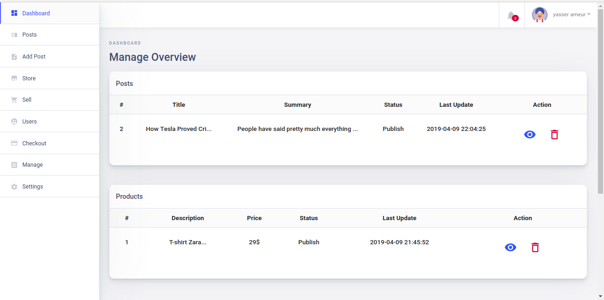
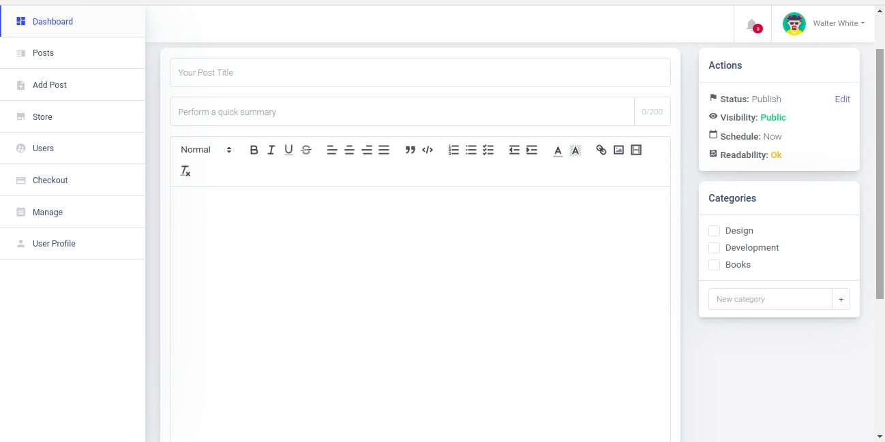

<p style="text-align=center;">

</p>

<p align="center">


</p>

<div align="center">
  <sub>Created by <a href="https://github.com/getspooky">getspooky</a> and maintained with ❤️ by an amazing <a href="https://github.com/getspooky/laravelDash/graphs/contributors">team of developers</a>.</sub>
</div>

## Table of Contents

- [Introduction](#Introduction)
- [Features](#Features)
- [Documentation](#Documentation)
- [Requirements](#Requirements)
- [Browser Support](#Browser-Support)
- [Usage](#Usage)
- [Contribute](#Contribute)
- [Security Vulnerabilities](#Security-Vulnerabilities)
- [Changelog](#changelog)
- [License](#license)
- [Support the Team](#Support-the-Team)

## Introduction 

🐳 It's never been easier to build and customize admin panels. Yah! laravelDash is a beautifully designed administration panel for Laravel.

<table>
  <tr>
    <td></td>
    <td></td>
   </tr> 
   <tr>
      <td></td>
      <td></td>
  </tr>
</table>

## Features

<dl>
  <dt>Dashboard Template</dt>
  <dd>The design don’t just look good though, they are also fully mobile responsive to accommodate users that are accessing your app, software, or website on their smartphones and tablets, no matter what size screen they have.</dd>
  <dt>Settings Manager</dt>
  <dd>The Settings section allows you to update your personal information.This can be anything from your First Name , Email , Country , Password , Address or Image.</dd>
  <dt>Vue2Editor Integration</dt>
  <dd>Your editor for rich text editing built with Vue.js and Quill.js , Simple setup so you can get started quickly , Offers the options you need for more complex scenarios</dd>
  <dt>Cross platform and browser support</dt>
  <dd>Build HTML5 web apps for desktops, tablets and smartphones with touch screen interface which work in all major browsers.</dd>
  <dt>Stripe Checkout</dt>
  <dd>Smart payment page that works seamlessly across devices and is designed to increase your conversion.
Payment methods: credit and debit cards, Apple Pay</dd>
</dl>

## Documentation

For installation instructions, in-depth usage and deployment details, please take a look at the official [documentation](https://getspooky.github.io/laravelDash/#/).

## Requirements
LaravelDash has a few requirements you should be aware of before installing:

- Composer
- Laravel Framework 5.4+ 
- Laravel Mix
- Node.js & NPM

## Browser Support

LaravelDash supports reasonably recent versions of the following browsers::

- Google Chrome
- Microsoft Edge
- Firefox
- Opera
- Safari


## Usage

> 🚨 The official guide assumes intermediate level knowledge of PHP.

### Minute 1: Create the Laravel application

we assume that you have been able to set up your development environment. There are two ways to install Laravel project

- Via Laravel Installer
- Via Composer Create-Project

I will be using via composer to create new project

```sh
composer create-project --prefer-dist laravel/laravel blog 
```

Laravel provides a quick way to scaffold all of the routes and views you need for authentication using one simple command:
```sh
composer require laravel/ui

php artisan ui --auth
```

### Minute 2: Configuration

Firstly, make sure to create a new database and add your database credentials to your .env file :
```sh
APP_URL=http://localhost
DB_HOST=localhost
DB_DATABASE=homestead
DB_USERNAME=homestead
DB_PASSWORD=secret
```

### Minute 3: Install and Configure laravelDash

LaravelDash is super easy to install. After creating your new Laravel application you can include the laravelDash package with the following command:

```sh
composer require yal/laraveldash
```

LaravelDash will automatically register its service provider if you are using Laravel >=5.5. If you are using LaravelDash with Laravel 5.3 or 5.4, add LaravelDash’s service provider in your application’s config/app.php file:

```php
/*
 * Laraveldash Service Provider
 */
yal\laraveldash\Providers\DashboardServiceProvider::class, 
```

Next, you need to publish the laravelDash configuration file:

```sh
php artisan vendor:publish --provider="yal\laraveldash\Providers\DashboardServiceProvider" --tag="config"
```

Next, you need to publish the laravelDash assets:

```sh
php artisan vendor:publish --provider="yal\laraveldash\Providers\DashboardServiceProvider" --tag="laravelDash-assets"
```

### Minute 4: Running Migrations and Defining Relationships

Generated migrations are regular Laravel migrations , Run the migrations with:

```sh
php artisan migrate
```

Or run the LaravelDash command, that provides you with what you need to start using LaravelDash

```sh
php artisan laraveldash:install
```

Database tables are often related to one another. For example, a blog post may have many comments, or an order could be related to the user who placed it. Eloquent makes managing and working with these relationships easy. so go to App\User.php and add UserRelation

```php
<?php

namespace App;

use Illuminate\Notifications\Notifiable;
use Illuminate\Foundation\Auth\User as Authenticatable;
use yal\laraveldash\Traits\UserRelation;

class User extends Authenticatable
{
    use Notifiable,UserRelation;

}
```

### Minute 5:Yah! You’re on LaravelDash !

To see it, you need to start a web server on your development machine. You can do this by running the following command:php artisan serve and then head to `http://localhost:8000/Dashboard`

## Contribute

Whether you're helping us fix bugs, improve the docs, or spread the word, we'd love to have you as part of the `LaravelDash` community! 💪💜  See CONTRIBUTING.md for more information on what we're looking for and how to get started.

Thanks goes to these wonderful people ([emoji key](https://allcontributors.org/docs/en/emoji-key)):

<!-- ALL-CONTRIBUTORS-LIST:START - Do not remove or modify this section -->
<!-- prettier-ignore -->
<table><tr><td align="center"><a href="https://github.com/getspooky"><br /><sub><b>Yasser A.Idrissi</b></sub></a><br /><a href="https://github.com/getspooky/laravelDash" title="Code">💻</a> <a href="" title="Documentation">📖</a> <a href="#ideas" title="Ideas, Planning, & Feedback">🤔</a> <a href="#review" title="Reviewed Pull Requests">👀</a> <a href="" title="Tests">⚠️</a><td align="center"><a href="https://github.com/oliuz"><br /><sub><b>Jose Rosado</b></sub></a><br /><a href="https://github.com/getspooky/laravelDash" title="Code">💻</a> <a href="" title="Documentation">📖</a> <a href="#ideas" title="Ideas, Planning, & Feedback">🤔</a> <a href="#review" title="Reviewed Pull Requests">👀</a> <a href="" title="Tests">⚠️</a></td><td align="center"><a href="https://github.com/AshrafBasry"><br /><sub><b>أشرف بصرى</b></sub></a><br /><a href="https://github.com/getspooky/laravelDash" title="Code">💻</a> <a href="" title="Documentation">📖</a><a href="#review" title="Reviewed Pull Requests">👀</a> <a href="" title="Tests">⚠️</a></td><td align="center"><a href="https://github.com/akiyamaSM"><br /><sub><b>Inani El Houssain</b></sub></a><br /><a href="https://github.com/getspooky/laravelDash" title="Code">💻</a> <a href="" title="Documentation">📖</a><a href="#review" title="Reviewed Pull Requests">👀</a> <a href="" title="Tests">⚠️</a></td><td align="center"><a href="https://github.com/oliuz"><br /><sub><b>Michael Millis</b></sub></a><br /><a href="https://github.com/getspooky/laravelDash" title="Code">💻</a> <a href="" title="Documentation">📖</a><a href="#review" title="Reviewed Pull Requests">👀</a> <a href="" title="Tests">⚠️</a></td><td align="center"><a href="https://github.com/u98"><br /><sub><b>Uchinka</b></sub></a><br /><a href="https://github.com/getspooky/laravelDash" title="Code">💻</a> <a href="" title="Documentation">📖</a><a href="#review" title="Reviewed Pull Requests">👀</a> <a href="" title="Tests">⚠️</a></td></tr></table>
<!-- ALL-CONTRIBUTORS-LIST:END -->

## Security Vulnerabilities

If you discover a security vulnerability within LaravelDash, please send an e-mail to Yasser Ameur El Idrissi via `getspookydev@gmail.com` . All security vulnerabilities will be promptly addressed.

## Changelog

Please see [CHANGELOG](CHANGELOG.md) for more information what has changed recently.

## License

The LaravelDash Library is open-source software licensed under the [MIT license](https://opensource.org/licenses/MIT).

## Support on Beerpay
Hey dude! Help me out for a couple of :beers:!

[](https://beerpay.io/getspooky/laravelDash)  [](https://beerpay.io/getspooky/laravelDash?focus=wish)
