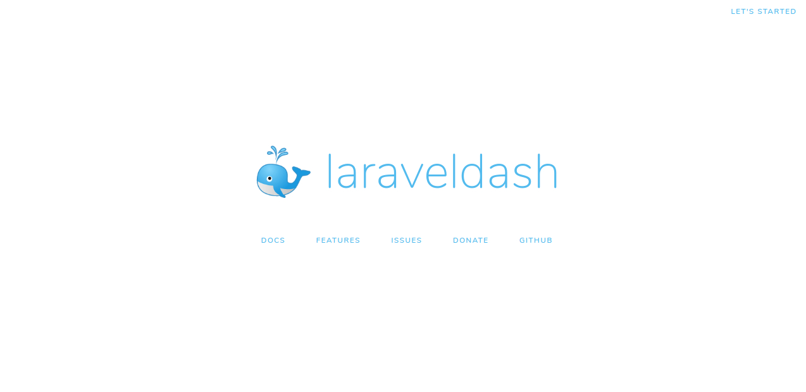

## Yah! You're on Laravel dashboard !

To see it, you need to start a web server on your development machine. You can do this by running the following command:

```shell
php artisan serve
```

To see your application in action, open a browser window and navigate to `http://localhost:8000`. 
You should see the Rails default information page:


